# Relatório da Análise Exploratória de Dados

O objetivo deste relatório é apresentar as conclusões da análise exploratória de dados realizada no conjunto de dados geral sobre as competições de vela (esporte) para várias classes de barcos. O conjunto foi coletado majoritariamente a partir de webscraping das súmulas das regatas.

## 1 Resultados da coleta de dados

Considerando o placar agregado de todas as regatas das competições, coletamos um total de cerca de 160000 registros de competidores, constando 69 competições distintas. A seguir apresentamos a distribuição de competições por classe de barco:

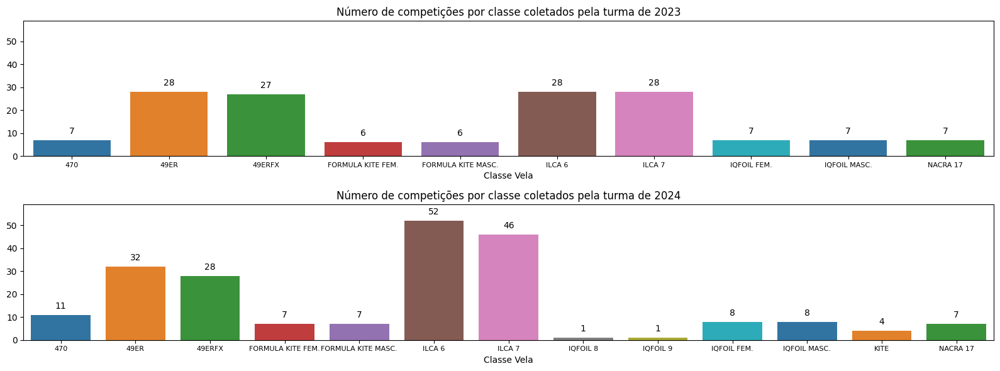

É possível observar uma predominância de dados Ilca 6 e Ilca 7, seguidos por 49er e 49erFX. As demais classes possuem uma quantidade menor de registros. Essa informação é fortalecida pela distribuição de registros por classe de barco:

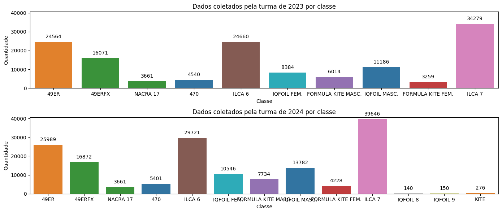

Para realizar essa análise, os dados foram agrupados por classe de barco e depois contabilizados o número de registros gerais e o número de registros distintos de competidores.

Em relação a coleta, agrupamos os registros por competição e contabilizamos o número de competidores que participou de cada evento em média. Desse modo, conseguimos contabilizar quais competições nos forneceram mais dados. A seguir, apresentamos a distribuição de competições por quantidade de edições:

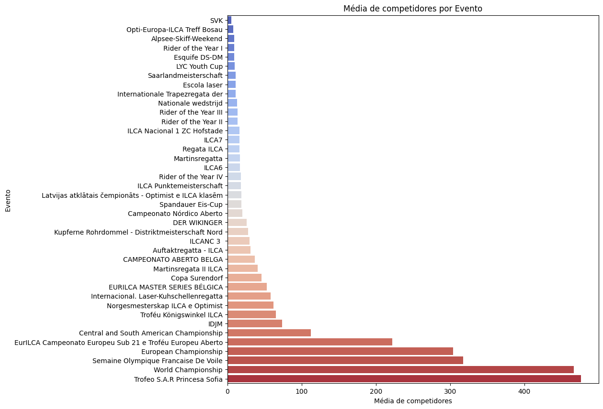
Além disso, contabilizamos também a média de regatas por classe, obtendo o seguinte resultado:

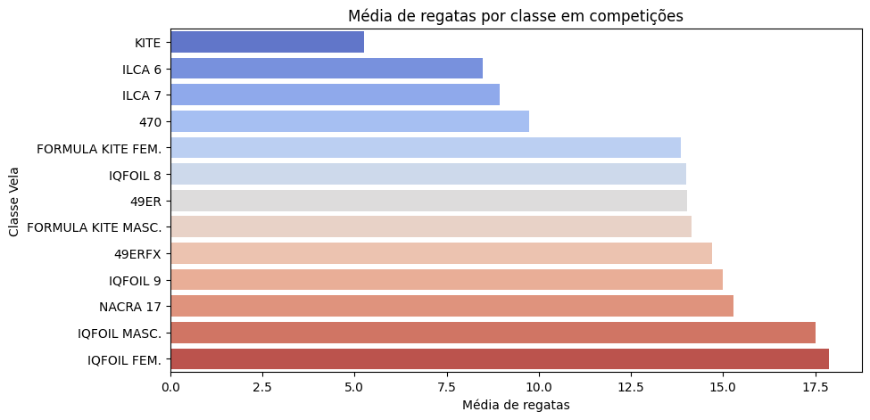
A próxima análise verifica a distribuição da quantidade distinta de competidores por competição. Para isso, agrupamos os registros por competição e contamos a quantas vezes cada competidor aparece por competição. A seguir, apresentamos a distribuição de participações dos atletas por competição:

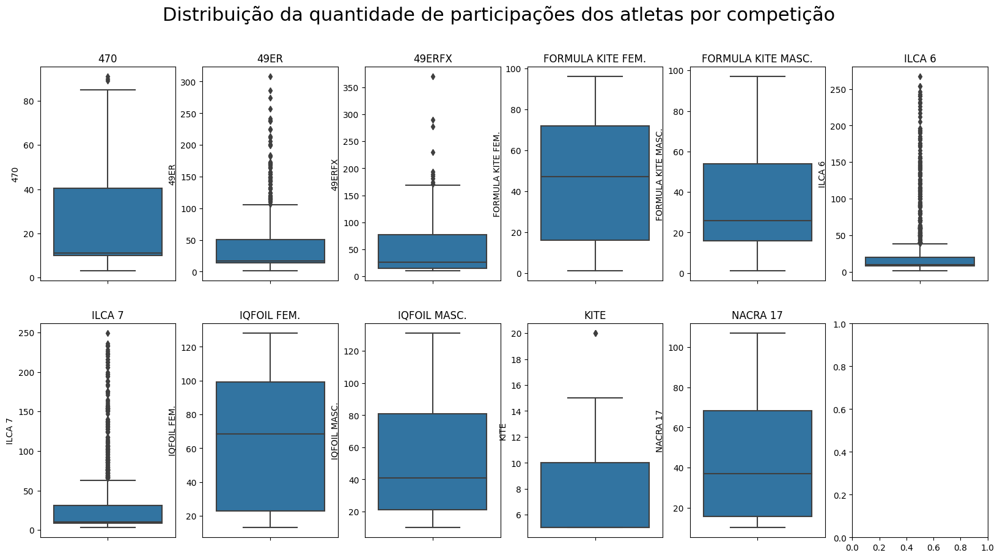

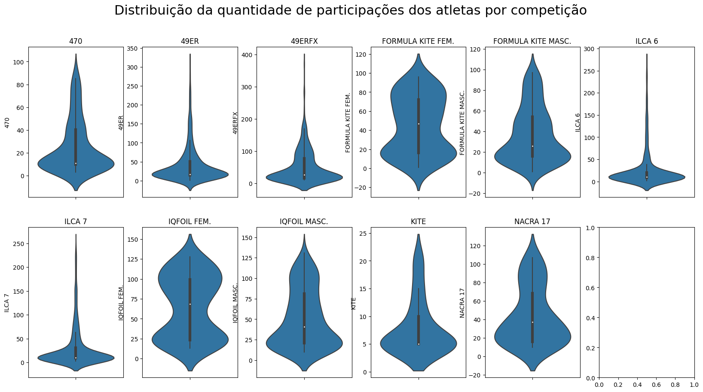

É possível notar que nas classes Ilca 6, Ilca 7, 49er e 49erFX, onde a quantidade de registros é maior, apresenta poucos competidores com muitas participações, com a média próxima de 20 regatas. Enquanto as demais classes possuem uma distribuição mais uniforme e com uma média mais elevada por volta de 50. 

Focando na análise das competições Ilca 6, Ilca 7, 49er e 49erFX, a próxima análise verifica em quais colocações os competidores mais frequentemente aparecem. 

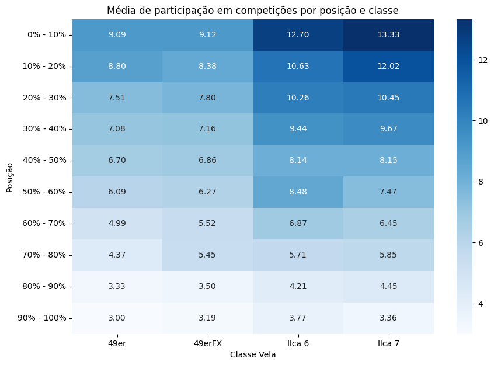

Ou seja, os competidores melhor classificados participam de mais competições, e portanto, possuem mais registros. Desse modo, é esperado que o nosso modelo consiga classificar bem os melhores competidores. A medida que a posição do competidor diminui, a incerteza sobre a classificação correta aumenta.

## 2 Comparação de duplas de competidores e competidores solos

A priori, é preciso esclarecer que a nossa base de dados possuiu mais registros de competidores solos do que de duplas. A seguir, apresentamos a distribuição de competidores que competem em duplas e também sozinhos:

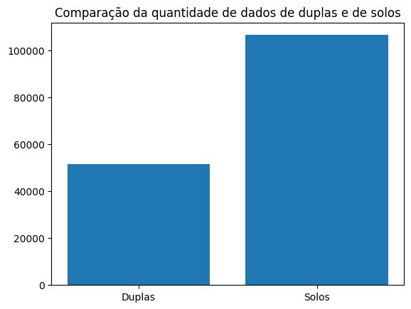

A pergunta que essa seção busca responder é: "Há competidores que competem em mais de uma classe de barco?". Primeiro, observamos se há competidores que corre em duplas e também sozinho. A seguir, apresentamos a distribuição de competidores que realizaram essa transição:

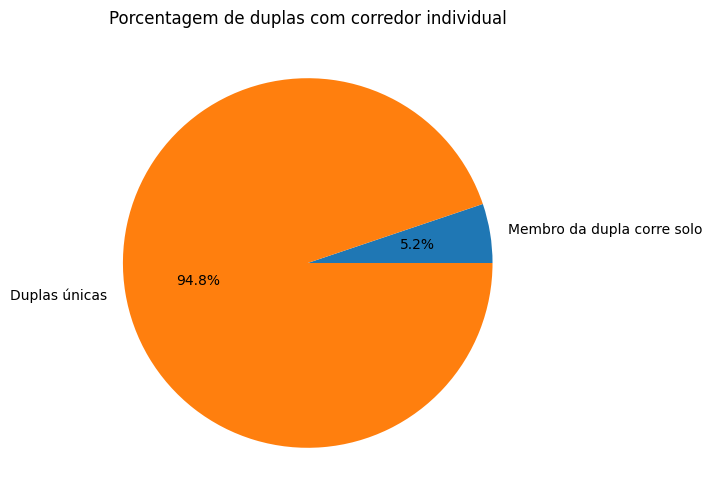

É possível notar que esse valor corresponde a minoria dos competidores. Para realizar essa análise, desmembramos os registros de competidores soles e de duplas, e contabilizamos o número de corredores distintos que aparecem em ambos os conjuntos. O próximo gráfico é semelhante ao anterior, mas considerando apenas os competidores solos:

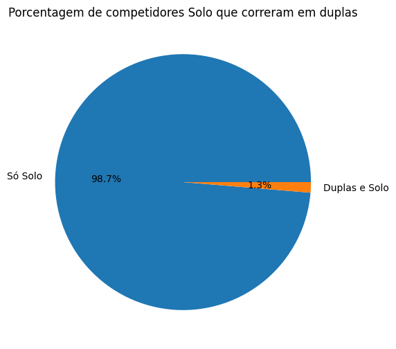

A próxima análise verifica a quantidade de competidores solos que mudaram de classe de barco. A seguir, apresentamos a distribuição de competidores que realizaram essa transição:

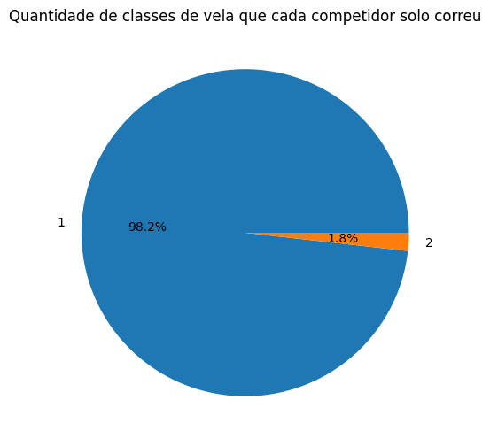

Foi feita uma análise similar a anterior, mas considerando apenas os competidores em duplas:

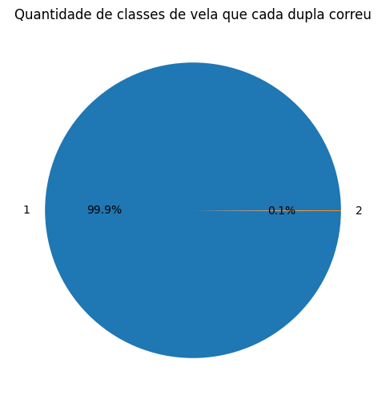

Para as duas análises acima, agrupamos os registros por competidor e contabilizamos o número de classes de barco distintas em que ele competiu, por fim, somamos o número de competidores que competiram em mais de uma classe de barco. Essa análise mostra que em geral os atletas de alto rendimento competem em uma única classe de barco.

A próxima análise verifica a quantidade de competidores que competem em duplas que mudaram de dupla ao longo do tempo, analisamos essa tendência em relação à posição que eles exercem, nota-se que os timoneiros são os que mais mudam de dupla:

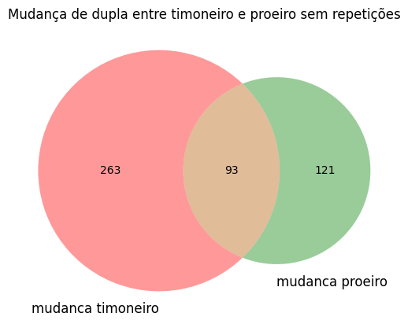

Considerando a quantidade de registros de 1198 duplas distintas, é possível notar que a troca de duplas é uma prática comum neste esporte. Para realizar esse cálculo, para cada dupla foi armazenado em um conjunto se um dos competidores mudou de dupla, se foi um timoneiro que mudou de dupla, tem-se um conjunto apenas com os timoneiros, e o mesmo foi feito para os proeiros. Por fim, encontramos a interseção entre os dois conjuntos, ou seja ambos mudaram de dupla, e somamos o número de registros. Em resumo, considere 4 duplas: (A,B), (A,C), (B,D), (A,E), contamos 4 trocas de duplas, pois A mudou de dupla 3 vezes e B mudou de dupla 1 vezes. Utilizando a estratégia de conjuntos conseguimos contabilizar as trocas de duplas sem repetir a contagem.
